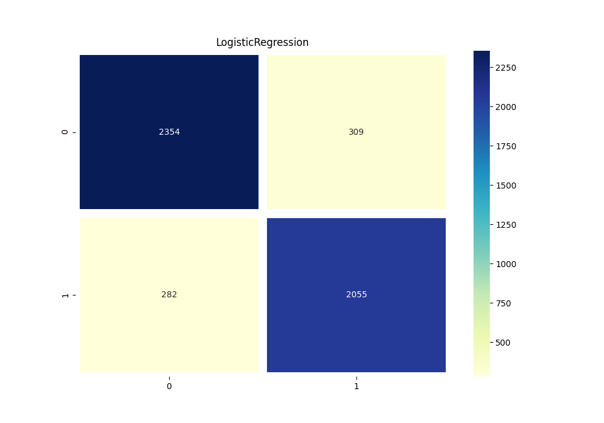
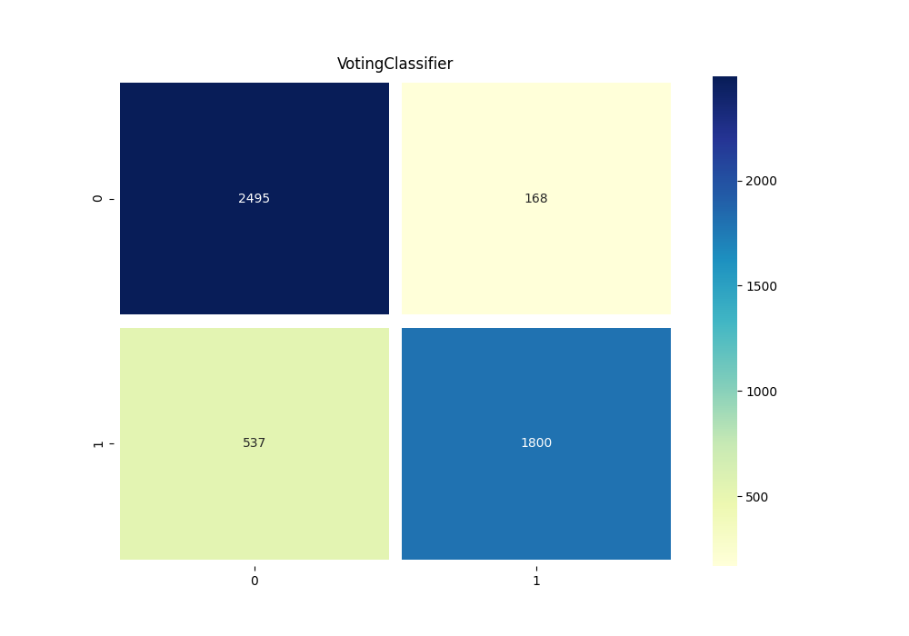

# Automatic misogyny identification

Kaggle competition (University of Bucharest, 2020): classify Italian tweets as misogynous or not. 5,000 labelled tweets for training, 1,000
unlabelled tweets to predict.

## Approach

1. **Preprocessing** (`preprocess_data.py`): lowercase, remove links and digits, strip accents
   and punctuation, tokenise with NLTK, drop tokens made of one repeated letter ("aaaa").
2. **Features:** TF-IDF over the 3,000 most frequent words, ignoring words in more than 40% of
   tweets.
3. **Models** (`model.py`): logistic regression, and a hard-voting ensemble of multinomial naive
   Bayes, logistic regression, a random forest (2,500 trees) and a linear SVM, tuned with grid
   search (`hyperparameter-tuning.py`).
4. **Evaluation:** 10-fold cross-validation on the training tweets.

## Results (10-fold cross-validation, 5,000 tweets)

| Model | Accuracy | Misogynous tweets found (recall) |
|---|---|---|
| Logistic regression | **88.2%** | **87.9%** |
| Voting ensemble | 85.9% | 77.0% |

The simpler model wins: the ensemble is more conservative and misses more misogynous tweets.

| Logistic regression | Voting ensemble |
|---|---|
|  |  |

## Running

```bash
pip install -r requirements.txt
python -c "import nltk; nltk.download('punkt'); nltk.download('punkt_tab')"
python main.py      # cross-validation, plots/ and submissions/
```
